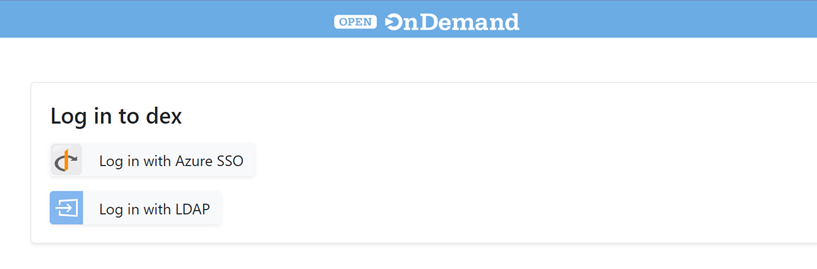
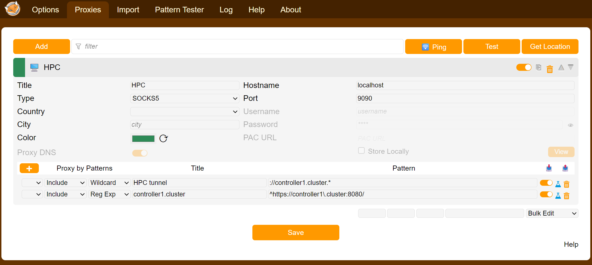
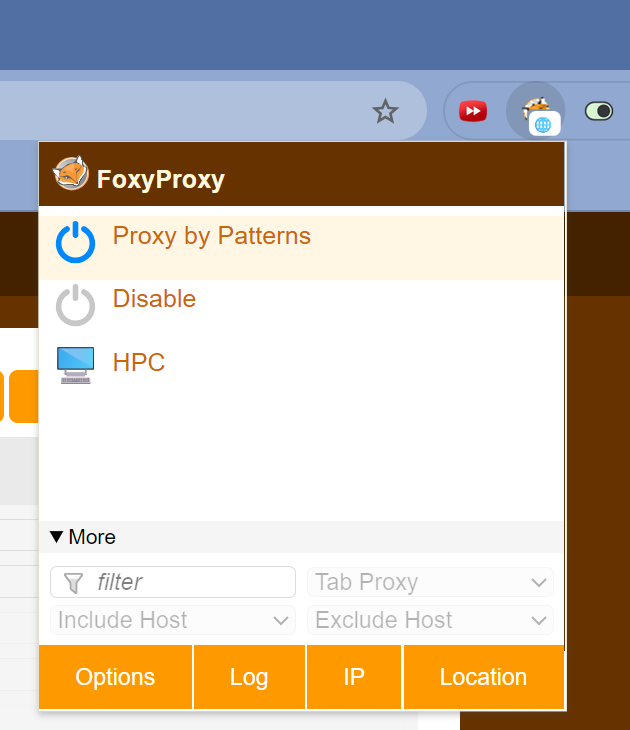

# HPC
Documentation for the HPC cluster

## Network Access
The cluster is reachable via the 'KdG' SSID. When on campus, simply connect to WiFi.  
*Note for researchers: it's not available on the NxT-Research wifi SSID.*

If you are working remote follow the steps described here for (only available in Dutch :-() [remote access](https://studentkdg.sharepoint.com/sites/intranet-nl-ict/SitePages/GlobalProtect-(VPN).aspx)

First step:
- Use the VPN solution or connect directly over wifi to the 'KdG' network.

### CLuster GUI access
To acces the TrinityX GUI setup a SOCKS v5 ssh tunnel:

Linux/MacOS:
- In a terminal run: `ssh -N -D 9090 tunneluser@compute.kdg.be`. Choose can choose a port at will instead of 9090, just something above 1024.
- The password is `HPC-access-2026!`
- The SSH-command **will block** but don't close the terminal (unless you get an error) as this will keep the SSH-tunnel open to reach the login page.
- Open your webbrowser and under network settings set a manual proxy with `localhost` and port `9090` or use the **Foxy Proxy plugin** (see below, which is the better option)
Now all your webbrowser traffic will be directed over the SOCKS tunnel. Normal internet acces might not always work, but you can acces the cluster GUI. 
- goto [https://controller1.cluster:8080](https://controller1.cluster:8080). You should see the login page of the TrinityX GUI.

- login with your school account credentials by clicking Azure SSO Login
Remember to change your settings back to no proxy after you are done and disconnect the SSH tunnel by typing `logout`. 

### Foxy Proxy Plugin
For now at least, the controller node has internet access in order to install dependencies.  Be aware that you are effectively using the cluster to browse the internet. It may be better to use plugins like [foxyproxy](https://addons.mozilla.org/en-US/firefox/addon/foxyproxy-standard/) to manage proxy usage in the browser. With a simple rule you can set the browser to *only* use the SOCKS tunnel for the cluster GUI. For example: `://controller1.cluster:*` as an include rule of the wildcard type works. 

You can mimick these settings:

Then select Proxy by Patterns and with will use the SOCKS proxy only for the cluster GUI based on the pattern you set.

### Starting a notebook. 
For now we use the controller GUI to spin up a notebook
In the GUI home page, click on Jupyter notebook under Interactive Apps. 
- Fill in your user account
For partition you can select:
- `defg` the entire cluster, but is shared. Just select the number of nodes you need, max=8. 
- `single_node` this is only node001 for debugging purposes. 
Note: email notification is not yet setup.
Click to connect, you will be taken to your home directory, from here you can create a notebook.
Note: by default you will load into Jupyter Classic, but you can switch to Jypyter Lab as well und `View > Lab`

## Alerts
in the KdG MS Teams environment the 'HPC' Teams has been configured to receive alerts from the clusters Grafana dashboard. No email alerts have been setup yet.

## SSH access 
For SSH acces you need either a password or you need to add your SSH public key to the server. 
to learn how to setup Key based authentication, see [Setup SSH](Setup%20SSH.md). 

## Admin login
open a terminal and login to controller over SSH: `ssh <username>@datalab.kdg.be`
Password login to login node `compute.kdg.be` is enabled. 

**Note that in the future password loging will be disabled, so please add your public key to the server once logged in for the first time.**
