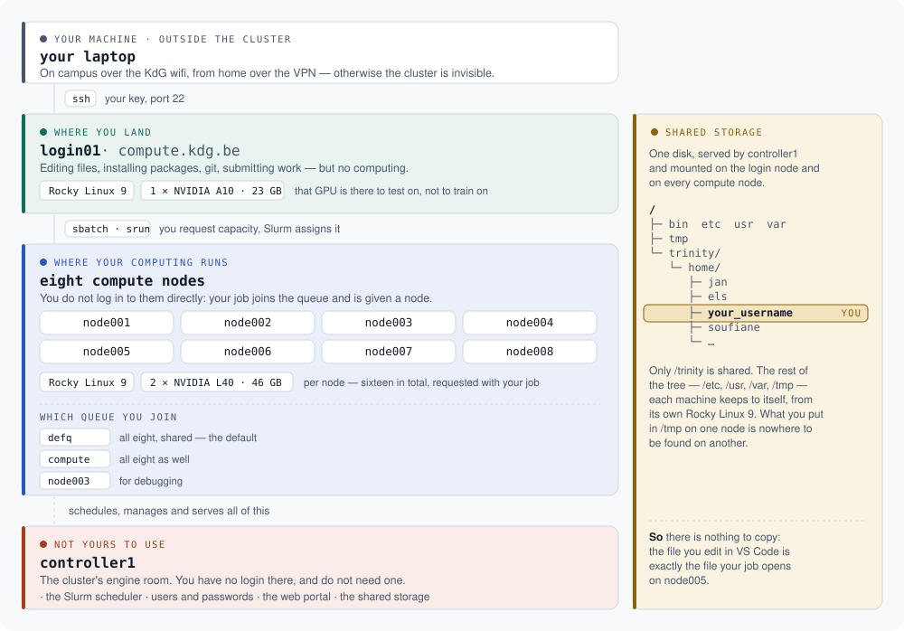
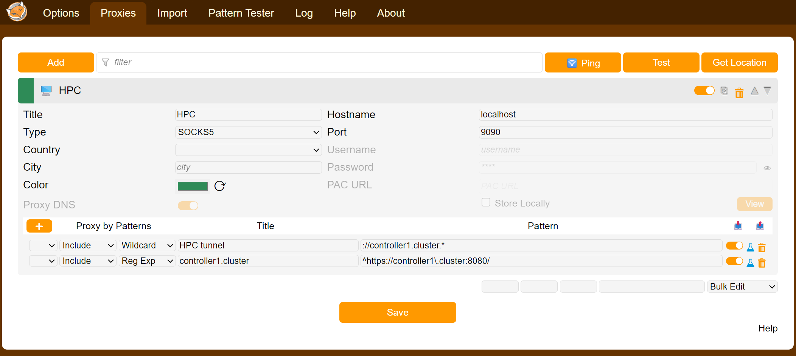
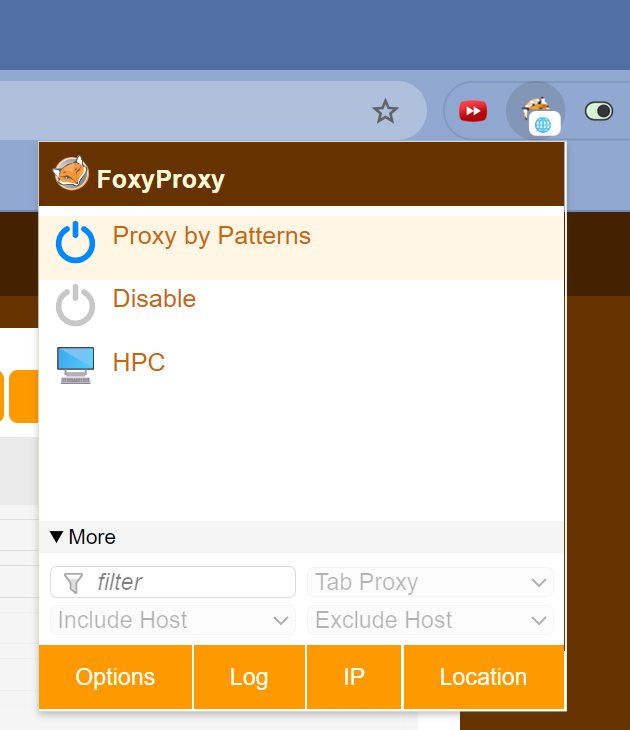
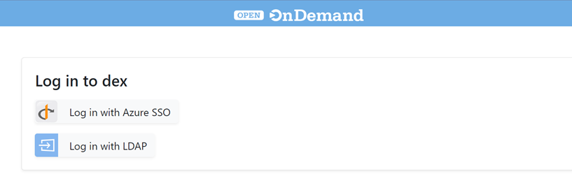

# Access to the KdG HPC cluster

*[Nederlandse versie](../nl/README.md) · [back to the start page](../../README.md)*

## The cluster at a glance

Four kinds of machine and one shared directory. Once you have seen this
picture, the rest of this page reads a good deal faster.

<p align="center">
  
</p>

| Machine | What it means for you |
|---|---|
| **login01** | The only machine you log in to. Editing files, installing packages, git, submitting work — but no computing: there is one of it and everyone shares it. Rocky Linux 9, with one NVIDIA A10 (23 GB) to test on. Docker and the Ray head run here too |
| **node001 … node008** | Where your computing runs. You do not log in to them directly; you submit work and Slurm assigns a node as soon as there is room. Rocky Linux 9, with two NVIDIA L40 GPUs (46 GB) per node, and a Ray worker on each |
| **controller1** | The engine room: the scheduler, user management, the web portal and the shared storage. You have no login there, and do not need one |
| **/trinity/home/…** | Your directory, the same one on the login node and on every compute node. What you save here your job sees too — no copying needed. Only `/trinity` is shared: `/tmp`, `/etc` and the rest of the system each machine keeps to itself |

---

The HPC team has mailed you an account name and a password. The steps below set
up your access in about two minutes.

| | |
|---|---|
| **Login node (SSH)** | `compute.kdg.be` |
| **Your directory** | `/trinity/home/your_username`, visible on every node |
| **Scheduler** | Slurm — `sbatch`, `srun`, `squeue` |
| **Web portal** | Open OnDemand, through a tunnel (see [step 5](#5-reaching-the-web-portal)) |

---

## 1. Connect to the network

The cluster is only reachable from the KdG network.

- **On campus:** connect to the `KdG` WiFi network.
- **From home:** turn on the **GlobalProtect VPN** —
  [instructions (NL)](https://studentkdg.sharepoint.com/sites/intranet-nl-ict/SitePages/GlobalProtect-(VPN).aspx)

Nothing below works without one of the two.

---

## 2. Run one command

Open your operating system's terminal and paste the command for your platform.
Use **Windows Terminal, PowerShell or Terminal.app** — not a terminal window
inside another application, where pasting does not always work and you will
need it for your password.

**Windows (PowerShell)**

```powershell
irm https://raw.githubusercontent.com/KdG-OCDI/hpc-public/main/tools/kdg-hpc-setup.ps1 | iex
```

**macOS or Linux (Terminal)**

```bash
curl -fsSL https://raw.githubusercontent.com/KdG-OCDI/hpc-public/main/tools/kdg-hpc-setup.sh | bash
```

Prefer to read the script first? Download it, then run it:

```bash
curl -fsSL https://raw.githubusercontent.com/KdG-OCDI/hpc-public/main/tools/kdg-hpc-setup.sh -o kdg-hpc-setup.sh
less kdg-hpc-setup.sh && bash kdg-hpc-setup.sh
```

The script asks for your account name, and then **once** for the password from
that mail, at the server's own prompt. That password goes straight to the
cluster; the script never reads or stores it.

Running it again is always safe — it applies nothing twice.

### What the script does

| Step | Action |
|---|---|
| 1 | Checks that the OpenSSH client is present |
| 2 | Asks for your account name |
| 3 | Checks that `compute.kdg.be` is reachable — catches "forgot the VPN" |
| 4 | Creates an `ed25519` key pair in `~/.ssh/` if you do not have one |
| 5 | Installs your **public** key on the login node |
| 6 | Adds a `kdg-compute` block to your local `~/.ssh/config` |
| 7 | Verifies that password-less login works |

Your **private** key never leaves your laptop.

---

## 3. Test your connection

```bash
ssh kdg-compute
```

You land on the login node without a password. Leave again with `exit`.

`kdg-compute` is the name the script wrote into your `~/.ssh/config` — not an
address on the internet. If you have not run step 2, use your account name and
the real address:

```bash
ssh your_username@compute.kdg.be
```

---

## 4. Your password

You needed the password from the mail once, in step 2. Not any more: from here
on you log in with your key.

**Keep that mail anyway**, or move the password to your password manager. It is
your way back in if you ever lose your key.

To replace it with one of your own, once your connection works:

```bash
ssh kdg-compute passwd
```

---

## 5. Reaching the web portal

Only needed if you want to use the portal, for instance for a
[Jupyter notebook in your browser](jupyter.md). If you would rather work in
your own editor, you can skip this chapter.

The portal runs on an address that only exists inside the cluster network. Your
browser cannot resolve that name, not even on the VPN. So you send your browser
traffic through a tunnel that resolves the name on the cluster side.

### Step 1 — open the tunnel

```bash
ssh -N -D 9090 kdg-compute
```

This command blocks and prints nothing. That is expected: leave the window open
while you use the portal. Any port number above 1024 works instead of 9090.

### Step 2 — send your browser through the tunnel

Use [FoxyProxy](https://addons.mozilla.org/firefox/addon/foxyproxy-standard/),
available for Firefox, Chrome and Edge. You can also do this in your operating
system's settings, but then **all** your internet traffic goes through the
cluster, including ordinary browsing. FoxyProxy lets you limit it to the
cluster address.

Create a proxy of type **SOCKS5**, host `localhost`, port `9090`:



Then add a rule of type *wildcard* with this pattern, and select
**Proxy by Patterns**:

```
://controller1.cluster:*
```



> **Important with SOCKS5:** the name `controller1.cluster` has to be resolved
> on the cluster side, not on your laptop. In Firefox that is the
> *Proxy DNS when using SOCKS v5* checkbox; FoxyProxy sets it correctly by
> itself. Doing this through your system settings often fails for exactly this
> reason.

### Step 3 — open the portal

Go to [https://controller1.cluster:8080](https://controller1.cluster:8080) and
click **Azure SSO Login** to sign in with your school account.



You are in. What you can do there is described in
[A Jupyter notebook through the portal](jupyter.md).

### When you are done

Close the tunnel with `Ctrl+C` and switch FoxyProxy off again.

> This whole chapter goes away once the portal gets an address that works over
> the VPN. You will simply type an address in your browser, with no tunnel and
> no extension.

---

## 6. Working with the cluster

Six ways, from simple to more advanced. Each page stands on its own; start
with whatever you need.

| | For | What you need |
|---|---|---|
| **[Jupyter notebook through the portal](jupyter.md)** | Trying things out and exploring, in your browser | A browser and the tunnel from step 5 |
| **[Working in your own editor](editor.md)** | Daily work, with your own extensions and shortcuts | VS Code, Cursor or PyCharm |
| **[Python, packages and git](python.md)** | Setting up a per-project environment | The terminal |
| **[Submitting work with Slurm](slurm.md)** | Work too heavy for the login node | Understanding of a queue |
| **[Distributed computing with Ray](ray.md)** | Work across several machines at once | A project with `ray[client]==2.55.1` |
| **[Running services in containers](containers.md)** | MLflow, Postgres, MinIO, LakeFS — alongside your computing | Docker on the login node |

Not sure where to start: [your own editor](editor.md) is what most people here
use day to day.

---

## 7. Lost access?

**New laptop, old one still in use.** Run the setup script on the new machine.
A second key is added; the one from your old laptop keeps working. You need the
password from the mail for this.

**Key lost or laptop stolen.** Run the script on your new machine, then remove
the old key from the server — otherwise whoever has that laptop keeps access.
Log in and open the file:

```bash
ssh kdg-compute
nano ~/.ssh/authorized_keys
```

Each line is one key, ending in a name such as `your_username@OLD-LAPTOP`.
Delete the line for the machine you lost, then save with `Ctrl+O`, `Ctrl+X`.

**Password lost too.** Contact the HPC team at
[compute@kdg.be](mailto:compute@kdg.be). Your identity is verified through your
KdG school account.

---

## 8. Troubleshooting

Run `ssh -v kdg-compute` — that output shows which key was offered and what the
server did with it.

| Message | Cause and fix |
|---|---|
| `compute.kdg.be is niet bereikbaar` | The VPN is off, or still connecting |
| `ssh.exe is niet gevonden` (Windows) | Run `Add-WindowsCapability -Online -Name OpenSSH.Client~~~~0.0.1.0` in PowerShell **as administrator** |
| `Permission denied` at the password prompt | Wrong account name or password — get in touch |
| `Permission denied (publickey)` | Your key is not on the server. Run step 2 again |
| `WARNING: UNPROTECTED PRIVATE KEY FILE` | Your private key is readable by others: `chmod 600 ~/.ssh/id_ed25519` |
| Key ignored, no message at all | `sshd` refuses `~/.ssh` when its permissions are too broad: `chmod 700 ~/.ssh` |
| `Could not resolve hostname kdg-compute` | You have not run step 2 — use the full address |
| The test in step 7 fails | Normal if you set a passphrase on your key; test with `ssh kdg-compute` |
| Your job sits at `PD` in `squeue` | The cluster is busy, or you asked for more than exists. `sinfo` shows what is free |
| Portal unreachable while the tunnel is open | FoxyProxy is off, or the name is being resolved locally (see step 5) |

Still stuck? Open an
[issue](https://github.com/KdG-OCDI/hpc-public/issues) or mail
[compute@kdg.be](mailto:compute@kdg.be), with the **full output** of the script
— it contains no secrets.

---

## More

- [Manual SSH setup](../../Setup%20SSH.md) — WSL, ssh-agent, several keys, and
  what the script does under the hood
