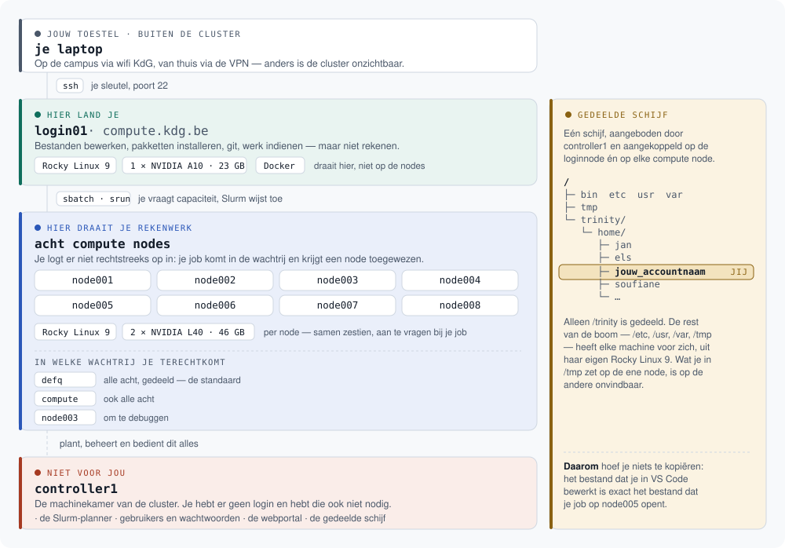

# Toegang tot de KdG HPC-cluster

*[English version](../en/README.md) · [terug naar de startpagina](../../README.md)*

## De cluster in één oogopslag

Vier soorten machines en één gedeelde map. Wie dit plaatje eenmaal ziet,
begrijpt de rest van deze pagina een stuk sneller.

<p align="center">
  
</p>

| Machine | Wat het voor jou betekent |
|---|---|
| **login01** | De enige machine waarop je inlogt. Bestanden bewerken, pakketten installeren, git, werk indienen — maar niet rekenen: er is er één en iedereen deelt hem. Rocky Linux 9, met één NVIDIA A10 (23 GB) om op te testen. Hier draaien ook Docker en de Ray head |
| **node001 … node008** | Waar je rekenwerk draait. Je logt er niet rechtstreeks op in; je dient werk in en Slurm wijst een node toe zodra er plaats is. Rocky Linux 9, met twee NVIDIA L40-GPU's (46 GB) per node, en elk een Ray worker |
| **controller1** | De machinekamer: de planner, het gebruikersbeheer, de webportal en de gedeelde schijf. Je hebt er geen login, en hebt die ook niet nodig |
| **/trinity/home/…** | Jouw map, op de loginnode én op elke node dezelfde. Wat je hier opslaat ziet je job ook — kopiëren hoeft niet. Alleen `/trinity` is gedeeld: `/tmp`, `/etc` en de rest van het systeem heeft elke machine voor zich |

---

Je hebt per mail een accountnaam en een wachtwoord gekregen van het HPC-team.
Hieronder zet je in ongeveer twee minuten je toegang op.

| | |
|---|---|
| **Loginnode (SSH)** | `compute.kdg.be` |
| **Je map op de cluster** | `/trinity/home/jouw_accountnaam`, zichtbaar op alle nodes |
| **Planner** | Slurm — `sbatch`, `srun`, `squeue` |
| **Webportal** | Open OnDemand, via een tunnel (zie [stap 5](#5-toegang-tot-de-webportal)) |

---

## 1. Verbind met het netwerk

De cluster is alleen bereikbaar vanaf het KdG-netwerk.

- **Op de campus:** verbind met het wifi-netwerk `KdG`.
- **Van thuis:** zet de **GlobalProtect VPN** aan —
  [instructies](https://studentkdg.sharepoint.com/sites/intranet-nl-ict/SitePages/GlobalProtect-(VPN).aspx)

Zonder een van beide werkt niets van wat hieronder staat.

---

## 2. Draai één commando

Open de terminal van je besturingssysteem en plak het commando voor jouw
platform. Gebruik daarvoor **Windows Terminal, PowerShell of Terminal.app**,
niet een terminalvenster binnen een andere toepassing — plakken werkt daar niet
altijd, en je hebt zo je wachtwoord nodig.

**Windows (PowerShell)**

```powershell
irm https://raw.githubusercontent.com/KdG-OCDI/hpc-public/main/tools/kdg-hpc-setup.ps1 | iex
```

**macOS of Linux (Terminal)**

```bash
curl -fsSL https://raw.githubusercontent.com/KdG-OCDI/hpc-public/main/tools/kdg-hpc-setup.sh | bash
```

Wil je eerst zien wat het script doet? Haal het dan op en lees het:

```bash
curl -fsSL https://raw.githubusercontent.com/KdG-OCDI/hpc-public/main/tools/kdg-hpc-setup.sh -o kdg-hpc-setup.sh
less kdg-hpc-setup.sh && bash kdg-hpc-setup.sh
```

Het script vraagt je accountnaam, en daarna **eenmalig** het wachtwoord uit die
mail, bij de prompt van de server. Dat wachtwoord gaat rechtstreeks naar de
cluster; het script leest of bewaart het niet.

Opnieuw draaien is altijd veilig — het script past niets dubbel toe.

### Wat het script doet

| Stap | Actie |
|---|---|
| 1 | Controleert of de OpenSSH-client aanwezig is |
| 2 | Vraagt je accountnaam |
| 3 | Controleert of `compute.kdg.be` bereikbaar is — vangt "VPN vergeten" af |
| 4 | Maakt een `ed25519`-sleutelpaar aan in `~/.ssh/` als je er nog geen hebt |
| 5 | Zet je **publieke** sleutel op de loginnode |
| 6 | Voegt een `kdg-compute`-blok toe aan je lokale `~/.ssh/config` |
| 7 | Test of wachtwoordloos inloggen werkt |

Je **private** sleutel verlaat je laptop nooit.

---

## 3. Test je verbinding

```bash
ssh kdg-compute
```

Je komt nu zonder wachtwoord op de loginnode terecht. Verlaten doe je met
`exit`.

`kdg-compute` is de naam die het script in je `~/.ssh/config` heeft gezet — geen
adres op het internet. Heb je stap 2 niet gedraaid, gebruik dan je accountnaam
en het echte adres:

```bash
ssh jouw_accountnaam@compute.kdg.be
```

---

## 4. Je wachtwoord

Je hebt het wachtwoord uit de mail nog één keer nodig gehad, in stap 2. Daarna
niet meer: inloggen gaat vanaf nu met je sleutel.

**Bewaar die mail toch**, of zet het wachtwoord in je wachtwoordbeheerder. Het
is je noodingang voor als je ooit je sleutel kwijt bent.

Wil je het vervangen door iets eigens, dan kan dat zodra je verbinding werkt:

```bash
ssh kdg-compute passwd
```

---

## 5. De webportal

Alleen nodig als je de portal wil gebruiken, bijvoorbeeld voor een
[Jupyter-notebook in je browser](jupyter.md). Werk je liever in je eigen
editor, dan kun je dit hoofdstuk overslaan.

Zet de VPN aan (of gebruik het KdG-netwerk) en ga naar:

**[https://datalab.kdg.be:8080](https://datalab.kdg.be:8080)**

Klik op **Azure SSO Login** en meld je aan met je schoolaccount. Verder niets:
geen tunnel, geen browser-extensie.


> **Je browser waarschuwt over het certificaat.** Klik op *Geavanceerd* en ga
> toch verder. Het certificaat van de server staat nog op een oude naam; er is
> een nieuw aangevraagd. Je verbinding is wel degelijk versleuteld — alleen kan
> je browser niet bevestigen wie er aan de andere kant zit, en binnen het
> KdG-netwerk is dat een aanvaardbaar risico.

Je bent nu binnen. Wat je er kunt doen staat in
[Een Jupyter-notebook via de portal](jupyter.md).

### Je eerste keer

Heb je nog geen account op de cluster, dan maakt de portal er bij je eerste
aanmelding zelf een aan, op basis van je schoolaccount. Je hebt dus geen
accountnaam of wachtwoord nodig om binnen te raken.

Wil je daarna ook via SSH werken — en dat wil je, want daar gebeurt het meeste
— dan heb je nog wel een sleutel nodig. Stuur een mail naar
[compute@kdg.be](mailto:compute@kdg.be) of volg [stap 2](#2-draai-één-commando).

---

## 6. Werken met de cluster

Zes manieren, van eenvoudig naar geavanceerder. Elke pagina staat op zichzelf;
begin bij wat je nodig hebt.

| | Waarvoor | Wat je nodig hebt |
|---|---|---|
| **[Jupyter-notebook via de portal](jupyter.md)** | Uitproberen en verkennen in je browser | Alleen een browser en de VPN |
| **[Werken in je eigen editor](editor.md)** | Dagelijks werk, met je eigen extensies en sneltoetsen | VS Code, Cursor of PyCharm |
| **[Python, pakketten en git](python.md)** | Een omgeving per project opzetten | De terminal |
| **[Rekenwerk indienen met Slurm](slurm.md)** | Werk dat te zwaar is voor de loginnode | Begrip van een wachtrij |
| **[Verdeeld rekenen met Ray](ray.md)** | Werk over meerdere machines tegelijk | Een project met `ray[client]==2.55.1` |
| **[Diensten draaien in containers](containers.md)** | MLflow, Postgres, MinIO, LakeFS — naast je rekenwerk | Docker op de loginnode |

Weet je niet waar te beginnen: [je eigen editor](editor.md) is wat de meeste
mensen hier dagelijks gebruiken.

---

## 7. Geen toegang meer?

**Nieuwe laptop, of je oude nog steeds in gebruik.** Draai het setupscript op
het nieuwe toestel. Er komt een tweede sleutel bij; die van je oude laptop
blijft gewoon werken. Je hebt hiervoor het wachtwoord uit de mail nodig.

**Sleutel kwijt of laptop gestolen.** Draai het script op je nieuwe toestel, en
verwijder daarna de oude sleutel van de server — anders houdt wie die laptop
heeft toegang. Log in en open het bestand:

```bash
ssh kdg-compute
nano ~/.ssh/authorized_keys
```

Elke regel is één sleutel, met achteraan een naam als
`jouw_accountnaam@LAPTOP-OUD`. Verwijder de regel van het toestel dat je kwijt
bent, en bewaar met `Ctrl+O`, `Ctrl+X`.

**Wachtwoord ook kwijt.** Neem contact op met het HPC-team via
[compute@kdg.be](mailto:compute@kdg.be). Je identiteit wordt gecontroleerd via
je KdG-schoolaccount.

---

## 8. Problemen oplossen

Draai `ssh -v kdg-compute` — die uitvoer laat zien welke sleutel is aangeboden
en wat de server ermee deed.

| Melding | Oorzaak en oplossing |
|---|---|
| `compute.kdg.be is niet bereikbaar` | VPN staat niet aan, of is nog aan het verbinden |
| `ssh.exe is niet gevonden` (Windows) | Draai `Add-WindowsCapability -Online -Name OpenSSH.Client~~~~0.0.1.0` in een PowerShell **als administrator** |
| `Permission denied` bij het wachtwoord | Accountnaam of wachtwoord klopt niet — neem contact op |
| `Permission denied (publickey)` | Je sleutel staat niet op de server. Draai stap 2 opnieuw |
| `WARNING: UNPROTECTED PRIVATE KEY FILE` | Je private sleutel is te ruim leesbaar: `chmod 600 ~/.ssh/id_ed25519` |
| Sleutel wordt genegeerd, zonder melding | `sshd` weigert `~/.ssh` bij te ruime rechten: `chmod 700 ~/.ssh` |
| `Could not resolve hostname kdg-compute` | Je hebt stap 2 niet gedraaid — gebruik het volledige adres |
| De test in stap 7 faalt | Normaal als je een passphrase op je sleutel zette; test met `ssh kdg-compute` |
| Je job blijft in `PD` staan in `squeue` | De cluster is bezet, of je vraagt meer dan er is. `sinfo` toont wat vrij is |
| Portal onbereikbaar | VPN staat niet aan. Het adres is `https://datalab.kdg.be:8080`, met de `https` en de poort erbij |

Lukt het niet? Open een
[issue](https://github.com/KdG-OCDI/hpc-public/issues) of stuur een mail naar
[compute@kdg.be](mailto:compute@kdg.be), met de **volledige uitvoer** van het
script erbij — die bevat geen geheimen.

---

## Meer

- [Handmatige SSH-installatie](../../Setup%20SSH.md) — WSL, ssh-agent, meerdere
  sleutels, en wat het script onder water doet
